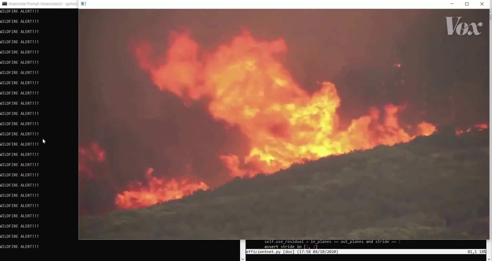

# Wildfire Detection based on NASA data

# NASA Space Apps Challenge

### For work done on the NASA MYD14A1 dataset, please see [Satellite_Fire_Detection](./Satellite_Fire_Detection)!

To summarise work done in Fire Detection for this project:  

1. Preparing a dataset: we create a binary classification dataset (fire vs no-fire images) using [1], [2], [3] and OpenCV (to get frame-by-frame output of fire videos), then split data using 8:2 train-test split, and further augment training images using Albumentations (HorizontalShift, ShiftScaleRotate, ElasticTransform) to 27k images  
2. Architecture search: we conduct a literature review on existing classification models (ResNet, MobileNet, VGGNet and more) and chose Efficient-Net for its state-of-the-art performance while utilising fewer parameters, balancing speed, resources and accuracy  
3. Creating a model: we redesign [4]'s training and model configuration code and add in our own dataset, in order to perform custom training of Efficient-Net on our compiled fire dataset. Due to time limitations and consideration for real-time inference, we utilise the Efficient-Net-b0 network  
4. Training: We perform training using 8 Titan X GPUs in parallel, using a batch size of 256. We apply transfer learning by fine-tuning pre-trained Efficient-Net weights on the ImageNet benchmark, training for 80 epochs (leaning_rate decay at 20,40,60 epochs, using SGD optimiser). Training took 2:42:55 hours  
5. Evaluation: After completing training, we performed evaluation on the test set and achieved an accuracy of 93% based on the torch.BCEWithLogitsLoss evaluation metric

## References:  
[1] http://web.mit.edu/torralba/www/indoor.html  
[2] https://www.kaggle.com/arnaud58/landscape-pictures  
[3] https://github.com/DeepQuestAI/Fire-Smoke-Dataset  
[4] https://github.com/narumiruna/efficientnet-pytorch

