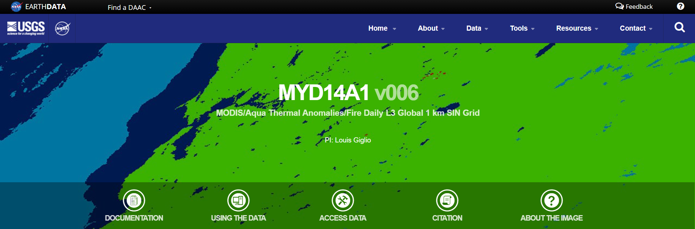
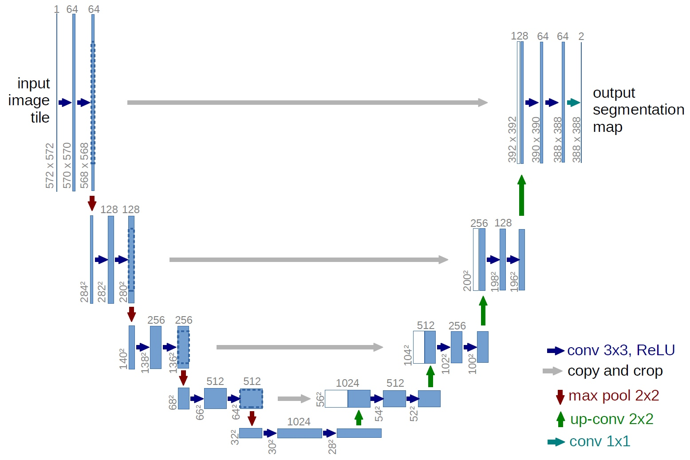
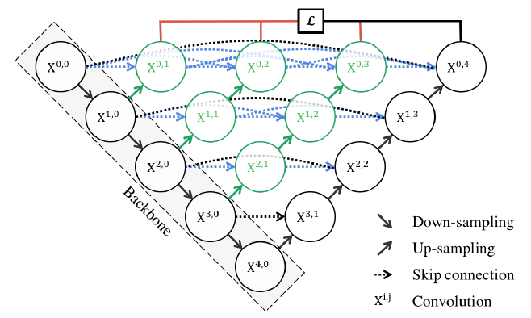
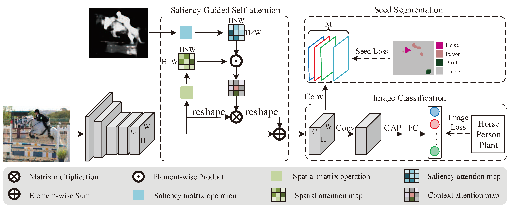

# MYD14A1 dataset
  
[MYD14A1 v006](https://lpdaac.usgs.gov/products/myd14a1v006/) [1] is a NASA EarthData dataset with the following description: The Aqua Moderate Resolution Imaging Spectroradiometer (MODIS) Thermal Anomalies and Fire Daily (MYD14A1) Version 6 data are generated every eight days at 1 kilometer (km) spatial resolultion as a Level 3 product. MYD14A1 contains eight consecutive days of fire data conveniently packaged into a single file. The Science Dataset (SDS) layers include the fire mask, pixel quality indicators, maximum fire-radiative-power (MaxFRP), and the position of the fire pixel within the scan. Each layer consists of daily per pixel information for each of the eight days of data acquisition.  

# Supervised Segmentation: U-Net vs MODIS
  
We propose a method based on NASA satellite image data, to improve upon the existing space wildfire detection algorithm used by NASA, namely MODIS. MODIS performs segmentation of satellite imagery, classifying each pixel into “water”, “land”, “fire”, etc. We propose to utilise Deep Learning on the Terra satellite Fire Radiative Power image dataset, through [U-Net](https://arxiv.org/abs/1505.04597) [2] and [nested U-Net](https://arxiv.org/abs/1807.10165) [3] to improve segmentation results. U-Net is an application of the fully-convolutional networks architecture, a special encoder-decoder model which enhances fusion of local to global, spatial-semantic features. We propose to leverage U-Net with nested, dense skip pathways and deep supervision to form nested U-Net, in order to surpass NASA’s current fire segmentation methods.  

# Unsupervised Segmentation: SGAN vs MODIS  

[SGAN](https://github.com/yaoqi-zd/SGAN) [4] is a weakly supervised semantic segmentation method which achieves state-of-the-art performance on the PASCAL VOC 2012 train & test datasets. This approach consists of 3 components: (1) a CNN backbone to learn deep feature representations; (2) a saliency guided self-attention module that propagates attentions from small discriminative parts to non-discriminative regions; (3) an image classification branch and a seed segmentation branch to supervise the training of the entire network. Due to the lack of segmentation labels in this detection task, we propose to leverage the SGAN Deep Learning method to replace MODIS in predicting thermal anomalies.

# References  
[1] [https://lpdaac.usgs.gov/products/myd14a1v006/](https://lpdaac.usgs.gov/products/myd14a1v006/)  
[2] [https://arxiv.org/abs/1505.04597](https://arxiv.org/abs/1505.04597)  
[3] [https://arxiv.org/abs/1807.10165](https://arxiv.org/abs/1807.10165)  
[4] [https://github.com/yaoqi-zd/SGAN](https://github.com/yaoqi-zd/SGAN)
